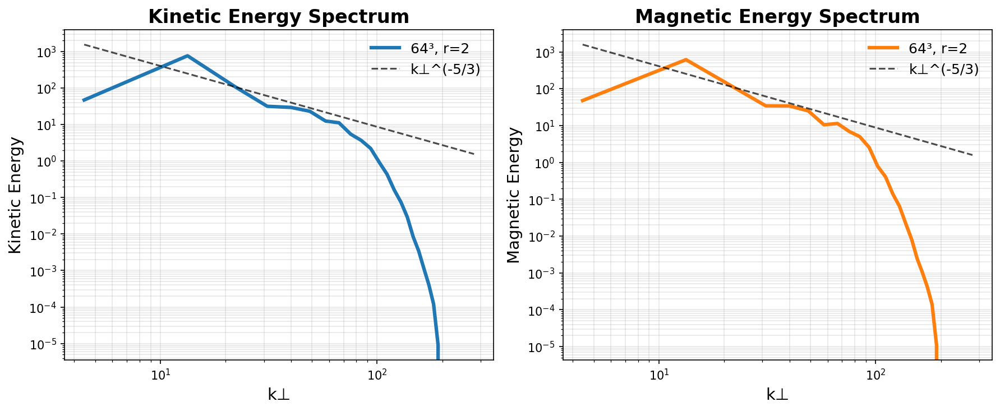

# Benchmark Checkpoints

This document catalogs validated simulation checkpoints that demonstrate key physics regimes and can be used as starting points for research or as reference solutions.

## Overview

Checkpoints are fully self-contained HDF5 files containing:
- Complete KRMHDState (all Fourier-space fields: z±, B∥, Hermite moments)
- Grid configuration (Nx, Ny, Nz, Lx, Ly, Lz)
- Physical parameters (M, beta_i, v_th, nu, Lambda)
- Metadata (timestamp, run parameters)

All checkpoints can be loaded with `load_checkpoint()` from `krmhd.io` and resumed with the `--resume-from` flag in simulation scripts.

---

## 64³ Balanced Elsasser Turbulence (t=200 τ_A)

**Location**: `examples/benchmark_checkpoints/64cubed_balanced_elsasser_t200.h5`

### Physics Parameters

| Parameter | Value | Description |
|-----------|-------|-------------|
| **Resolution** | 64³ | Spectral grid points (Nx × Ny × Nz) |
| **Domain** | 2π × 2π × 2π | Periodic box (Lx, Ly, Lz) |
| **Hyper-resistivity** | η = 6.0 | Normalized dissipation coefficient |
| **Hyper-order** | r = 2 | Hyper-dissipation exponent |
| **Forcing** | Balanced Elsasser | z⁺ = z⁻ forcing (drives flow, not magnetic reconnection) |
| **Force amplitude** | 0.048 | Gaussian white noise amplitude |
| **Forced modes** | n = 1-2 | Large-scale energy injection |
| **Evolution time** | 200 τ_A | Alfvén crossing times |
| **Total energy** | 1.73 × 10⁴ | Reached quasi-steady state |
| **Magnetic fraction** | 0.46 | E_mag / E_total |

### Results: Turbulent Inertial Range

This checkpoint demonstrates a **well-developed turbulent inertial range** with the expected Kolmogorov/Iroshnikov-Kraichnan spectrum:

- **Inertial range**: k⊥ ~ 2-12 (mode numbers n ~ 2-12)
- **Scaling**: E(k⊥) ∝ k⊥^(-5/3) observed in both kinetic and magnetic spectra
- **Critical balance**: Anisotropic cascade with k⊥ >> k∥ (RMHD ordering preserved)



### Run History

**Initial Conditions**: Random spectrum with k^(-5/3) power law, weak amplitude (E₀ ~ 10⁻⁴)

**Evolution**:
1. **Spin-up (0-50 τ_A)**: Energy injection from forcing, cascade develops
2. **Transition (50-150 τ_A)**: Inertial range emerges, approaching quasi-steady state
3. **Quasi-steady (150-200 τ_A)**: Turbulent cascade established, spectrum stabilizes

**Command used**:
```bash
uv run python examples/alfvenic_cascade_benchmark.py \
  --resolution 64 \
  --total-time 200 \
  --averaging-start 180 \
  --balanced-elsasser \
  --max-nz 1 \
  --eta 6.0 \
  --hyper-r 2 \
  --force-amplitude 0.048 \
  --save-spectra \
  --checkpoint-interval-time 75
```

### Usage

**Load and inspect**:
```python
from krmhd.io import load_checkpoint
from krmhd.physics import energy
from krmhd.diagnostics import energy_spectrum_perpendicular_kinetic

# Load checkpoint
state, grid, metadata = load_checkpoint("examples/benchmark_checkpoints/64cubed_balanced_elsasser_t200.h5")

print(f"Time: t = {state.time:.1f} τ_A")
print(f"Grid: {grid.Nx}×{grid.Ny}×{grid.Nz}")
print(f"Energy: {energy(state)['total']:.4e}")

# Compute spectrum
k_perp, E_kin = energy_spectrum_perpendicular_kinetic(state)
```

**Resume and extend**:
```bash
# Continue evolution to t=400 with modified parameters
uv run python examples/alfvenic_cascade_benchmark.py \
  --resolution 64 \
  --total-time 400 \
  --averaging-start 300 \
  --balanced-elsasser \
  --eta 6.0 \
  --hyper-r 2 \
  --force-amplitude 0.035 \  # Reduced for cleaner cascade
  --resume-from examples/benchmark_checkpoints/64cubed_balanced_elsasser_t200.h5
```

**Plot spectrum from checkpoint**:
```bash
# Standard plot (mode numbers)
uv run python examples/plot_checkpoint_spectrum.py \
  examples/benchmark_checkpoints/64cubed_balanced_elsasser_t200.h5

# Thesis-style plot (wavenumbers)
uv run python examples/plot_checkpoint_spectrum.py \
  --thesis-style \
  examples/benchmark_checkpoints/64cubed_balanced_elsasser_t200.h5
```

### Physics Interpretation

**Why balanced Elsasser forcing?**

The balanced Elsasser forcing (z⁺ = z⁻) has critical advantages over traditional forcing methods:

1. **Drives perpendicular flow only**: Forces φ (stream function) without directly forcing A∥ (vector potential)
2. **Avoids spurious reconnection**: Traditional z⁺ ≠ z⁻ forcing can drive magnetic reconnection artifacts
3. **Preserves RMHD physics**: Maintains k⊥ >> k∥ cascade without artificial parallel structure

See Issue #99 for implementation details.

**Energy partition**:
- Magnetic fraction f_mag = 0.46 < 0.5 indicates the turbulence is still evolving
- For fully developed steady-state turbulence, expect f_mag → 0.5 (equipartition) or f_mag > 0.5 (selective decay)
- Longer runs or reduced forcing may increase f_mag

**Parameter stability**:
- η = 6.0 with r = 2 is a **validated stable configuration** for 64³ forced turbulence
- Lower η or higher forcing amplitude may trigger instabilities (see Issue #82 for 64³ parameter constraints)
- Higher r (r = 4) provides sharper dissipation cutoff but requires careful parameter tuning at 64³ resolution

### Extending the Inertial Range

To improve spectral quality (wider/cleaner inertial range):

**Option 1: Reduce forcing amplitude** (RECOMMENDED)
- Resume from this checkpoint with amplitude = 0.03-0.035
- Gentler energy injection → cleaner cascade
- More stable, lower risk of numerical instabilities

**Option 2: Higher hyper-dissipation order**
- Use r = 4 for sharper high-k cutoff
- Requires stronger η (10-15) or weaker forcing at 64³
- Higher risk of instability (test carefully)

**Option 3: Longer averaging**
- Resume to t = 400, average spectra from t = 300-400
- Better statistics, reduced noise
- No physics change, just cleaner measurement

### References

- **Implementation**: PR #XX, Issue #99 (balanced Elsasser forcing)
- **Validation**: `examples/alfvenic_cascade_benchmark.py`
- **Analysis tools**: `examples/plot_checkpoint_spectrum.py`, `examples/analyze_spectrum_quality.py`
- **Related**: CLAUDE.md Section "Alfvénic turbulent cascade (Thesis Section 2.6.3)"

---

## Future Checkpoints

Additional benchmark checkpoints to be added:
- 32³ stable turbulence (η=1.0, r=2) - lower resolution reference
- 128³ high-resolution turbulence - production-quality inertial range
- Kinetic physics examples (M=10, M=20) - Landau damping regime
- Orszag-Tang vortex snapshots - nonlinear MHD benchmark

---

## Contributing Checkpoints

To add a new benchmark checkpoint:

1. **Run validation**: Ensure stability for >100 τ_A, verify expected physics
2. **Add checkpoint**: Copy to `examples/benchmark_checkpoints/` with descriptive name
3. **Generate plots**: Use `plot_checkpoint_spectrum.py --thesis-style`
4. **Document**: Add section to this file with parameters, usage, interpretation
5. **Test**: Verify checkpoint loads and resumes correctly

Checkpoints should represent **validated physics regimes** useful for research or as starting points for parameter studies.
